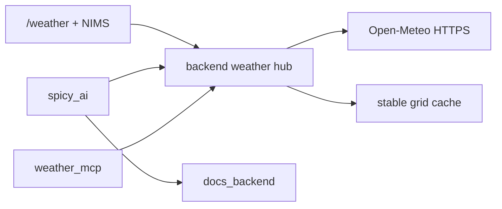

# IC SPICY Weather Desk — Phase 0 Spec Freeze

| Field | Value |
|---|---|
| **Status** | PHASES 1–6 CODE COMPLETE — weather_mcp local green; mainnet MCP + frontend pending “yes, deploy to mainnet” |
| **Approved plan** | Full Weather Desk + SpicyAi + ICP MCP (chat 2026-07-30) |
| **Deploy policy** | Mainnet only after explicit “yes, deploy to mainnet” |
| **Save date** | July 30, 2026 |
| **Skills fetched** | `https-outcalls`, `motoko`, `canister-security` (2026-07-30) |
| **D1** | Anonymous zip resolve — **approved** |
| **Phase 2** | Model spread + `/weather` page + alerts + SEO — **code complete** |

---

## 0. Kickoff

This document freezes types, cache schema, outcall transforms, design tokens, SVG weather states, and the `/weather` wireframe before any Motoko or React implementation.

**Do not start Phase 1 until project lead confirms:**
1. Candid types in [§2](#2-candid-types--cache-schema-frozen) are accepted
2. Design tokens / SVG storyboard in [§4](#4-design-tokens--svg-storyboard) are accepted
3. Wireframe sections in [§5](#5-weather-page-wireframe) are accepted
4. Open decisions in [§8](#8-open-decisions) are resolved or deferred with notes

**Phase 1 scope (next):** grid cache + 7-day outlook outcall + `getWeatherOutlook` + kill browser Open-Meteo in `useWeather` — no tropical desk, no MCP, no SpicyAi weather mode yet.

---

## 1. Baseline in repo today (extend, do not replace)

| Existing | Location | Relationship |
|---|---|---|
| Nursery daily capture | `lib/weather-provenance.mo`, `nims-api.mo` `runDailyWeatherCapture` | Keep; expand URL builders + transforms for multi-day / multi-model |
| `WeatherSnapshot` | `types/plants.mo` | **Unchanged** — plant provenance NFT metadata stays 1-day compact |
| `getLatestNurseryWeather` | public query | Keep; desk uses richer `WeatherOutlook` alongside |
| Browser Open-Meteo | `lib/weather-service.ts` | **Retire in Phase 1** as primary path |
| NIMS immersive panel | `WeatherImmersivePanel.tsx` | Keep for NIMS; CTA → `/weather`; later share vector components |
| Doppler iframe | `WeatherRadarMap.tsx` | **Not** on-chain data; Phase 2+ desk uses SVG tropical map; radar may remain attribution-only or NIMS-only |
| SpicyAi | `spicy_ai_canister` + widget | Phase 4: `chatWithWeather` + brief injection |
| Masterclass Module 5 | `storms-and-extreme-weather.md` | SpicyAi BM25 grounding |
| Fleet cycles ops | auto top-up + LP fee pipeline | Budget outcall load against existing runway |

**Locked from `PROJECT_CONTEXT.md`:**
- Open-Meteo via HTTPS outcall; deterministic transforms; strip headers
- User locations rounded to **0.1°** (~7 mi)
- Group by location to reduce outcalls
- SpicyAi zero-log; conversation in localStorage only

---

## 2. Candid types & cache schema (FROZEN)

### 2.1 Design rules

1. **Do not mutate** `WeatherSnapshot` shape (upgrade + NFT metadata compatibility).
2. New desk types live in `types/weather-hub.mo` (new) — shared types only (no `var`, no Maps).
3. Mutable cache state uses **side maps** keyed by `Text` / `Principal` (Phase 4 upgrade lesson).
4. Caps: max **500** grid cells, **20** storms, **50** alerts/user, **200** event log entries, zip cache unbounded but capped at **2000** zips with LRU eviction preferred.

### 2.2 Grid key

```text
gridKey(lat, lng) = Float.format("#.#", round(lat * 10) / 10)
                  # ","
                  # Float.format("#.#", round(lng * 10) / 10)
```

Nursery fixed: `26.9767,-82.0837` → grid `27.0,-82.1` (document exact rounding in Motoko helper; unit-test).

### 2.3 Shared types (Candid / Motoko)

```motoko
// types/weather-hub.mo — Phase 1+ (frozen for Phase 0)

module {
  public type WeatherModel = { #gfs; #ecmwf };

  public type DailyOutlook = {
    date : Text;                 // YYYY-MM-DD
    tempHighF : Float;
    tempLowF : Float;
    precipInches : Float;
    uvIndexMax : Float;
    windMphMax : Float;
    weatherCode : Nat;           // WMO code (0–99)
  };

  public type CurrentConditions = {
    tempF : Float;
    feelsLikeF : Float;
    humidity : Float;
    precipInches : Float;
    uvIndex : Float;
    windMph : Float;
    windDirDeg : Float;
    weatherCode : Nat;
    pressureHpa : Float;
  };

  public type AirQuality = {
    usAqi : Nat;
    pm25 : Float;
    pm10 : Float;
  };

  public type ModelDay = {
    date : Text;
    precipInches : Float;
    tempHighF : Float;
  };

  public type ModelSpread = {
    gfs : [ModelDay];            // up to 7
    ecmwf : [ModelDay];
  };

  public type WeatherOutlook = {
    gridKey : Text;
    lat : Float;                 // rounded
    lng : Float;
    fetchedAt : Int;             // Time.now() ns
    source : Text;               // e.g. "open-meteo|historical-forecast"
    current : CurrentConditions;
    daily : [DailyOutlook];      // 7 days
    airQuality : ?AirQuality;
    models : ?ModelSpread;       // null until Phase 2
    stale : Bool;                // true if older than policy TTL
  };

  public type WeatherLocation = {
    kind : { #zip : Text; #coords };
    zip : ?Text;
    lat : Float;                 // stored rounded
    lng : Float;
    label : Text;                // e.g. "Port Charlotte, FL" or "ZIP 33954"
    updatedAt : Int;
  };

  public type StormBasin = { #atlantic; #eastPacific };

  public type StormTrackPoint = {
    timeUtc : Text;              // ISO or YYYYMMDDHH
    lat : Float;
    lng : Float;
    maxWindKt : Nat;
  };

  public type TropicalStorm = {
    id : Text;                   // e.g. "AL092022"
    name : Text;
    basin : StormBasin;
    advisoryNum : Nat;
    lat : Float;
    lng : Float;
    maxWindKt : Nat;
    movementText : Text;
    validAt : Int;
    track : [StormTrackPoint];   // compact; max ~40 points
  };

  public type TropicalSummary = {
    fetchedAt : Int;
    seasonActive : Bool;
    storms : [TropicalStorm];
    disclaimer : Text;
  };

  public type AlertKind = {
    #heavyRain;
    #highWind;
    #extremeHeat;
    #highUv;
    #tropicalThreat;
  };

  public type WeatherAlert = {
    id : Nat;
    kind : AlertKind;
    title : Text;
    body : Text;
    severity : { #info; #watch; #warning };
    createdAt : Int;
    expiresAt : Int;
    gridKey : Text;
  };

  public type WeatherBrief = {
    generatedAt : Int;
    gridKey : Text;
    text : Text;                 // deterministic prose for SpicyAi / MCP
    outlookFetchedAt : Int;
    tropicalFetchedAt : ?Int;
  };
};
```

### 2.4 Stable state (side maps — actor fields)

| Field | Type | Notes |
|---|---|---|
| `weatherGridCache` | `Map<Text, WeatherOutlook>` | Key = gridKey; replace whole outlook record on refresh |
| `weatherGridAccess` | `Map<Text, Int>` | lastAccessed ns — timer eviction / refresh priority |
| `userWeatherLocations` | `Map<Principal, WeatherLocation>` | auth only |
| `zipCoordCache` | `Map<Text, { lat; lng; label; fetchedAt }>` | zip → coords |
| `tropicalSummary` | `?TropicalSummary` | single latest |
| `weatherAlertsByUser` | `Map<Principal, [WeatherAlert]>` | or List; cap 50 |
| `latestNurseryWeather` | existing `?WeatherSnapshot` | unchanged |
| `nextWeatherAlertId` | `{ var value : Nat }` | |

### 2.5 Public API surface (Phase mapping)

| Method | Phase | Auth | Kind |
|---|---|---|---|
| `getWeatherOutlook(lat : ?Float, lng : ?Float)` | 1 | public | query |
| `getNurseryWeatherDesk()` | 1 | public | query (= outlook at nursery + snapshot meta) |
| `resolveZip(zip : Text)` | 1 | rate-limited update | update |
| `setMyWeatherLocation` / `getMyWeatherLocation` | 1 | auth | update / query |
| `adminRefreshWeatherGrid(gridKey)` | 1 | admin | update |
| `getModelSpread(...)` or field on outlook | 2 | public | query |
| `getMyWeatherAlerts` | 2 | auth | query |
| `getTropicalSummary` / `getStormTrack` | 3 | public | query |
| `getWeatherBrief` | 4 | public | query |
| `chatWithWeather` (spicy_ai) | 4 | auth / rate limit | update |
| MCP tools | 5 | public + rate limit | HTTP MCP |

### 2.6 Compatibility with plant provenance

- Daily nursery timer continues writing `WeatherSnapshot` via existing `snapshotFromParsed`.
- Desk `WeatherOutlook` is **orthogonal** — richer UX; do not embed full outlook in NFT metadata.
- Optional later: copy today's high/low/rain from outlook into snapshot fields (same numbers).

---

## 3. HTTPS outcalls — skill notes (fetched 2026-07-30)

Per [`https-outcalls` SKILL.md](https://skills.internetcomputer.org/.well-known/skills/https-outcalls/SKILL.md):

| Rule | Application |
|---|---|
| Always transform | Strip **all** headers; canonicalize JSON body |
| Always `max_response_bytes` | Never omit (defaults to 2MB / ~21.5B cycles) |
| Attach cycles | Prefer `Call.httpRequest` if migrating; existing code uses `(with cycles = …)` — keep consistent with backend until deliberate migration |
| HTTPS only | Open-Meteo + NHC public HTTPS |
| Handle failures | Stale cache + `stale = true`; never trap the timer on single failure |
| `is_replicated = null` | All cache-mutating outcalls |

### 3.1 Transform field lists (canonical bodies)

#### A. Forecast / multi-day (extend current `canonicalWeatherBody`)

**Keep (deterministic):**
- `daily.time`, `daily.temperature_2m_max`, `daily.temperature_2m_min`, `daily.precipitation_sum`, `daily.uv_index_max`, `daily.wind_speed_10m_max`, `daily.weathercode` (or `weather_code`)
- `current.temperature_2m`, `current.relative_humidity_2m`, `current.apparent_temperature`, `current.precipitation`, `current.weather_code`, `current.wind_speed_10m`, `current.wind_direction_10m`, `current.uv_index`, `current.surface_pressure`

**Strip / discard:**
- All headers
- `generationtime_ms`, `utc_offset_seconds` if variable, `current.time`, `hourly.*` (too large / time-skew risk)
- Any model metadata timestamps

**Bounds:** `max_response_bytes = 20_000` for 7-day daily+current (no hourly). Prefer `forecast_days=7` without hourly arrays.

#### B. Air quality

**Keep:** `current.us_aqi`, `current.pm2_5`, `current.pm10`  
**Strip:** headers, `current.time`, generation fields  
**Bounds:** `max_response_bytes = 4_000`

#### C. Geocode (Open-Meteo Geocoding API)

**Keep:** first result `latitude`, `longitude`, `name`, `admin1`, `country_code`  
**Strip:** headers, ranking scores if non-deterministic, excess results  
**Bounds:** `max_response_bytes = 8_000`  
**Policy:** US zips only for v1 (`country_code=US`)

#### D. Multi-model (Phase 2)

Separate outcalls or `&models=` if API returns deterministic arrays per model. Canonicalize to:
```json
{"gfs":{"daily":{...}},"ecmwf":{"daily":{...}}}
```
with only `time`, `precipitation_sum`, `temperature_2m_max`.

#### E. Tropical (Phase 3)

Prefer **small** public JSON/CSV (ATCF a-deck subset or NHC CurrentStorms). Transform must parse to fixed field order:
```json
{"storms":[{"id":"...","name":"...","lat":0,"lng":0,"maxWindKt":0,"advisory":0,"track":[["t",lat,lng,kt],...]}]}
```
Never store raw GIS GeoJSON blobs in transform output. Cap track length in transform.

### 3.2 Upstream URLs (v1)

| Purpose | Base |
|---|---|
| Live/historical forecast | `https://historical-forecast-api.open-meteo.com/v1/forecast` (existing stability choice) |
| Archive backfill | `https://archive-api.open-meteo.com/v1/archive` |
| Air quality | `https://air-quality-api.open-meteo.com/v1/air-quality` |
| Geocode | `https://geocoding-api.open-meteo.com/v1/search` |
| Tropical | TBD Phase 3 spike (NHC CurrentStorms / ATCF) — must pass consensus fixture test |

### 3.3 Timer policy (frozen intent)

| Job | Cadence | Notes |
|---|---|---|
| Nursery outlook + snapshot | every **6h** in-season (Jun–Nov), else **24h** | Align with existing daily capture; may merge into one outcall |
| Active user grids | every **6h** if `lastAccessed` &lt; 30 days | Cap concurrent refreshes per timer tick (e.g. 10 cells) |
| Tropical | every **6h** Jun 1–Nov 30 ET | Off-season: weekly or on admin |
| Alerts evaluation | after each grid/tropical refresh | Pure compute, no outcall |

### 3.4 Security notes (from `canister-security`)

- Public **queries** for outlook/tropical — fine; do not trust query-only for billing
- `resolveZip` / `setMyWeatherLocation` / refresh: reject anonymous where required; rate-limit updates
- `inspect_message`: allow anonymous for public updates only if any; prefer zip resolve behind auth **or** strict per-principal/IP-less canister rate map
- Unbounded storage: enforce caps above
- CallerGuard if Phase 1+ refresh paths await outcalls from user-triggered updates

### 3.5 Motoko notes (from `motoko` skill)

- `mo:core` only; types in `types/`; logic in `lib/`; API in `mixins/weather-hub-api.mo`
- No `var` fields inside shared Candid records
- Timers: `transient` timer IDs; re-register after upgrade

---

## 4. Design tokens & SVG storyboard

### 4.1 Brand alignment

Reuse app fonts: **Space Grotesk** (display), **Satoshi** (body), **Geist Mono** (timestamps / coords).

Extend CSS variables under a weather desk scope (do not redefine global primary):

```css
/* Proposed — src/frontend/src/styles/weather-desk.css (Phase 2) */
[data-weather-desk] {
  --wd-sky-clear: oklch(0.72 0.08 220);
  --wd-sky-overcast: oklch(0.45 0.02 240);
  --wd-sky-storm: oklch(0.28 0.04 260);
  --wd-gulf: oklch(0.42 0.08 200);
  --wd-citrus: oklch(0.78 0.14 95);       /* Florida citrus highlight */
  --wd-heat: oklch(0.68 0.20 35);          /* aligned with --primary pepper red-orange */
  --wd-rain: oklch(0.65 0.12 230);
  --wd-wind: oklch(0.75 0.04 180);
  --wd-alert: oklch(0.70 0.18 55);
  --wd-safe: oklch(0.65 0.14 145);
  --wd-ink: oklch(0.92 0.01 60);
  --wd-muted: oklch(0.55 0.02 55);
}
```

**Avoid:** purple gradients, cream+terracotta brochure look, emoji rain as primary motif (current NIMS panel uses emoji drops — desk uses vector strokes instead).

### 4.2 Hero composition (first viewport)

| Element | Spec |
|---|---|
| Brand | IC SPICY wordmark / mark — hero-level |
| Title | “Weather Desk” |
| Headline | One line: *Florida weather you can trust — on-chain.* |
| Support | One short sentence (Ian / Charley → free grower resource) |
| Controls | Zip input + “Nursery (33954)” chip |
| Visual | Full-bleed **vector sky** (edge-to-edge), big temp overlay bottom-left |
| CTA | Secondary text link: “Ask SpicyAi” — not a floating badge on the sky |

**Forbidden in hero:** stat strips, schedule cards, radar widgets, model charts, tropical map.

### 4.3 SVG weather states (WMO → scene)

| State id | WMO codes | Sky | Motion (respect `prefers-reduced-motion`) |
|---|---|---|---|
| `clear` | 0–1 | Soft gradient dawn/gulf blue; sun disk | Slow sun glow pulse (opacity) |
| `partly` | 2 | Sun + 2–3 cloud path groups | Clouds drift translateX loop |
| `overcast` | 3 | Flat slate; soft cloud layer | Very slow opacity breathe |
| `fog` | 45–48 | Low-contrast veil rects | Horizontal veil slide |
| `drizzle` | 51–55 | Overcast + thin diagonal stroke rain | Rain lines CSS/SVG animate |
| `rain` | 61–65, 80–82 | Darker sky + denser strokes | Faster rain; optional ground splash lines |
| `storm` | 95–99 | Storm slate + occasional flash rect | Flash opacity keyframes; wind streak lines |
| `heat` | overlay if temp ≥ 100°F | Amber wash on any base | Heat shimmer (subtle scaleY on wash) |

**Implementation notes:**
- Single `<svg viewBox="0 0 1440 720">` with layered `<g data-layer="sky|sun|clouds|precip|flash">`
- Crossfade layers by `weatherCode` + `tempF` (Framer Motion `AnimatePresence` or CSS)
- No bitmap sky photos in v1

### 4.4 Secondary vector widgets

| Widget | Style |
|---|---|
| 7-day strip | Day label + mini sparkline precip bar + high/low — flat, no cards if possible; light separators |
| Model desk | Dual polyline (GFS vs ECMWF) precip; legend with citrus / gulf strokes |
| Tropical map | Simplified FL + Gulf coastline paths; storm as animated circle + track polyline from canister points |
| AQI | Existing ring pattern OK; restyle strokes to `--wd-*` |
| On-chain badge | Mono timestamp + canister short id; hairline border, not a marketing sticker over hero |

### 4.5 Motion budget

Ship **3 intentional motions** on `/weather`:
1. Sky state morph / rain strokes
2. Temp count-up (reuse NIMS spring pattern)
3. Storm marker pulse on tropical map (Phase 3)

Everything else static or one-shot enter.

---

## 5. `/weather` page wireframe

### 5.1 Route & SEO (Phase 2 ship with page)

| Item | Value |
|---|---|
| Path | `/weather` |
| Aliases (optional later) | `/florida-weather` redirect |
| Index | Yes — `sitemap.xml` + prerender |
| Title | Florida Grower Weather Desk — On-Chain Forecast \| IC SPICY |
| Description | Free on-chain Florida weather for growers. 7-day outlook, model comparison, and tropical tracking — built after Hurricanes Charley and Ian. Powered by the Internet Computer. |

### 5.2 Scroll sections (one job each)

```text
┌─────────────────────────────────────────────────────────────┐
│ 0 HERO — brand + headline + zip + vector sky + big temp     │
├─────────────────────────────────────────────────────────────┤
│ 1 NOW — humidity / wind / UV / rain-next / AQI (compact)    │
├─────────────────────────────────────────────────────────────┤
│ 2 SEVEN-DAY GROWER OUTLOOK — precip bars + spray/mulch hint │
├─────────────────────────────────────────────────────────────┤
│ 3 MODEL DESK — GFS vs ECMWF (Phase 2)                       │
├─────────────────────────────────────────────────────────────┤
│ 4 TROPICAL DESK — SVG map + storms (Phase 3)                │
│   disclaimer: not official NHC / NWS                        │
├─────────────────────────────────────────────────────────────┤
│ 5 ASK SPICYAI — chips: Brief me / Storm prep / Foliar?      │
├─────────────────────────────────────────────────────────────┤
│ 6 ON-CHAIN + BUILDERS — fetch time, ICP badge, MCP teaser   │
├─────────────────────────────────────────────────────────────┤
│ 7 NIMS — deep link to plant provenance weather              │
└─────────────────────────────────────────────────────────────┘
Footer disclaimer (always): Aggregated public weather products.
Not a substitute for NWS / NHC official forecasts.
```

### 5.3 Nav / entry points

- Main nav or Resources: **Weather**
- Footer link
- NIMS weather panel: “Open Weather Desk →”
- Home: optional strip (not first-viewport clutter)
- Masterclass Module 5: app link → `/weather`

### 5.4 Auth matrix (UX)

| Capability | Anonymous | II authenticated |
|---|---|---|
| Nursery + default FL outlook | ✓ | ✓ |
| Enter zip (resolve) | ✓ rate-limited **or** auth-only (see §8) | ✓ |
| Save default location | ✗ | ✓ |
| Personal alerts | ✗ | ✓ |
| SpicyAi weather chat | per existing SpicyAi rules | ✓ |

---

## 6. SpicyAi & MCP (frozen intent; later phases)

### SpicyAi (Phase 4)

- Backend `getWeatherBrief` → deterministic text from cache only
- `chatWithWeather`: brief + BM25 Module 5; system rule forbids inventing storms
- Widget chips on `/weather` call `openSpicyAi(prompt)`

### MCP (Phase 5)

- Dedicated `weather_mcp` canister (`mcp-motoko-sdk`) calling backend queries
- Tools: `get_florida_outlook`, `get_model_spread`, `get_tropical_desk`, `get_grower_brief`, `get_nursery_conditions`
- Public read + rate limits; list on Prometheus; document Inspector URL on `/weather` builders section
- **Do not start until Phase 1–2 queries are stable**

---

## 7. Phase 1 implementation checklist (for next approval)

When Phase 1 is approved, agent will:

1. Add `types/weather-hub.mo` with frozen types (§2.3)
2. Add `lib/weather-grid.mo`, extend `weather-provenance.mo` URL/parse/transform for 7-day + current
3. Add `mixins/weather-hub-api.mo`; wire in `main.mo`; timer hook
4. Regenerate declarations
5. Rewrite `fetchWeatherData` / `useWeather` to query canister first
6. `mops check` + local deploy + smoke: `getWeatherOutlook`, `getNurseryWeatherDesk`
7. **No** `/weather` page yet (Phase 2) unless explicitly pulled forward
8. Show diffs for review before apply if still operating under “show diffs” preference for large edits

**Test approach:** Motoko parse fixtures; local outcall; confirm transform consensus; frontend nursery coords render from cache without browser Open-Meteo.

---

## 8. Open decisions

| # | Question | Recommendation | Status |
|---|---|---|---|
| D1 | Anonymous `resolveZip`? | Allow with tight canister rate limit | **Accepted** — anonymous resolveZip + ensureWeatherOutlook (ingress small-arg heuristic + method rate limits + 60/hr global geocode budget) |
| D2 | Exact nursery grid rounding | Implement helper + golden test; document result here after Phase 1 | Deferred to Phase 1 |
| D3 | Keep Doppler on NIMS? | Yes for now; not on `/weather` hero | Proposed accept |
| D4 | MCP canister name | `weather_mcp` | Proposed accept |
| D5 | In-season months | Jun 1–Nov 30 America/New_York | Proposed accept |
| D6 | Pull `/weather` UI into Phase 1? | No — data first, beauty in Phase 2 | Proposed accept |

---

## 9. Approval gate

**Phase 0 deliverables complete:**
- [x] Skills fetched and transform field lists noted
- [x] Candid / cache schema frozen
- [x] Design tokens + SVG storyboard
- [x] `/weather` wireframe
- [x] Phase 1 checklist ready

**Reply to proceed:**

> `approve phase 1` — implement on-chain outlook foundation  
> or  
> `phase 0 changes: …` — adjust types/design/decisions first

---

## Appendix A — Mermaid (architecture reminder)



## Appendix B — Emotional / copy north star

> We took direct hits from Charley and Ian. This desk exists so Florida growers get a fast, honest, on-chain heads-up — then SpicyAi tells you what to do with mulch, drainage, and biology.
